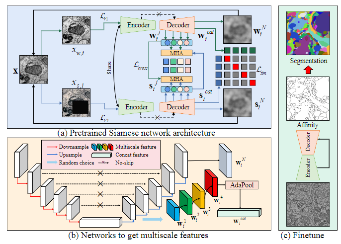

# MS-Con-EM-Seg
This is an official implement for Learning Multiscale Consistency for Self-supervised Electron Microscopy Instance Segmentation (ICASSP 24)
[\<Paper Link\>](https://arxiv.org/abs/2308.09917)

<details>
  <summary>Visitor Count</summary>
  
</details>



## Environment Setup

To set up the required environment, you can choose from the following options:

- **Using pip**:
  You can install the necessary Python dependencies from the `requirements.txt` file using the following command:

  ```bash
  pip install -r requirements.txt

We highly recommend using Docker to set up the required environment. Two Docker images are available for your convenience:

- **Using Docker from ali cloud**:
  - [**registry.cn-hangzhou.aliyuncs.com/cyd_dl/monai-vit:v26**](https://registry.cn-hangzhou.aliyuncs.com/cyd_dl/monai-vit:v26)
  
  ```bash
  docker pull registry.cn-hangzhou.aliyuncs.com/cyd_dl/monai-vit:v26
  
- **Using docker from dockerhub**:
  - [**cyd_docker:v1**](https://ydchen0806/cyd_docker:v1)
  
  ```bash
  docker pull ydchen0806/cyd_docker:v1
  
## Dataset Download

The datasets required for pre-training and segmentation are as follows:

| Dataset Type          | Dataset Name           | Description                              | URL                                           |
|-----------------------|------------------------|------------------------------------------|-----------------------------------------------|
| Pre-training Dataset  | Region of FAFB Dataset | Fly brain dataset for pre-training       | [EM Pretrain Dataset](https://huggingface.co/datasets/cyd0806/EM_pretrain_data/tree/main)  |
| Segmentation Dataset  | CREMI Dataset          | Challenge on circuit reconstruction datasets| [CREMI Dataset](https://cremi.org/)           |
| Segmentation Dataset  | [AC3/AC4 ](https://software.rc.fas.harvard.edu/lichtman/vast/AC3AC4Package.zip) | AC3/AC4 Dataset | [Mouse Brain GoogleDrive](https://drive.google.com/drive/folders/1JAdoKchlWrHnbTXvnFn6pWWwx6VIiMH3?usp=sharing) |


## Usage Guide

### 1. Pretraining
```
python pretrain.py -c pretraining_all -m train
```
### 2. Finetuning
```
python finetune.py -c seg_3d -m train -w [your pretrained path]
```

## Cite
If you find this code or dataset useful in your research, please consider citing our paper:
```
@inproceedings{chen2024learning,
  title={Learning multiscale consistency for self-supervised electron microscopy instance segmentation},
  author={Chen, Yinda and Huang, Wei and Liu, Xiaoyu and Deng, Shiyu and Chen, Qi and Xiong, Zhiwei},
  booktitle={ICASSP 2024-2024 IEEE International Conference on Acoustics, Speech and Signal Processing (ICASSP)},
  pages={1566--1570},
  year={2024},
  organization={IEEE}
}
```
# Contact 
If you need any help or are looking for cooperation feel free to contact us. cyd0806@mail.ustc.edu.cn
